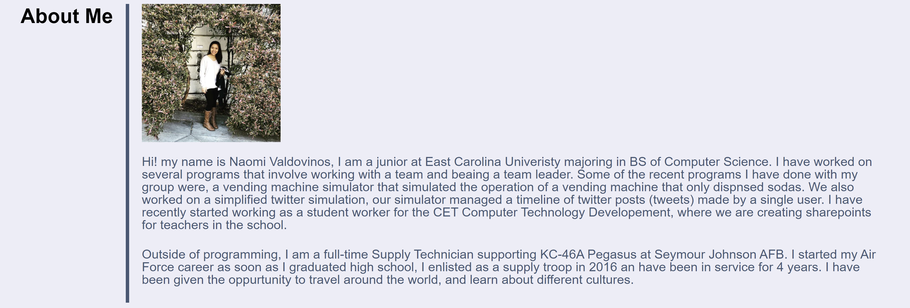
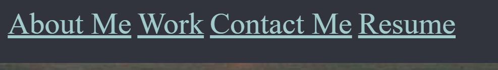
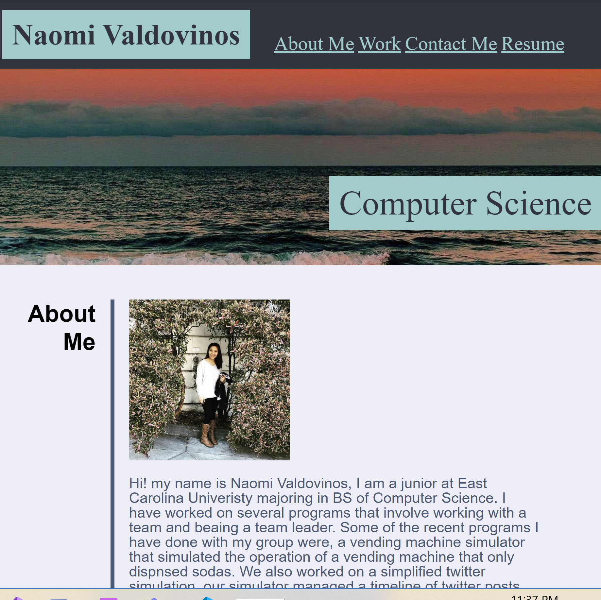

# Homework2-Portfolio

## This porject is made to showcase skills and talents to employers looking to fill a part-time or full-time position in the future. The core skills that were applied that I have recently learned were CSS variables, flex-box and media queries. 

---

**When Employer opens portfolio, section About me is presented with recent photo of me a summary of me.**

---
**Navigation links are presented corresponding to my work, about me, how to contact me.**

---
**Navigation links allows user to navigate to its correspending section**

<!-- <nav class="nav" id="navigation"> -->
                <a href="#about">About Me</a>
                <a href="#work">Work</a>
                <a href="#contact">Contact Me</a>
                <a href="#resume">Resume </a>

---              

**When user resizes the page or view the site in different screens, the layout is responsive and adapts to their viewport**

           
           

